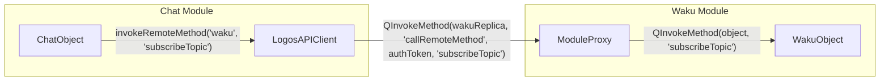
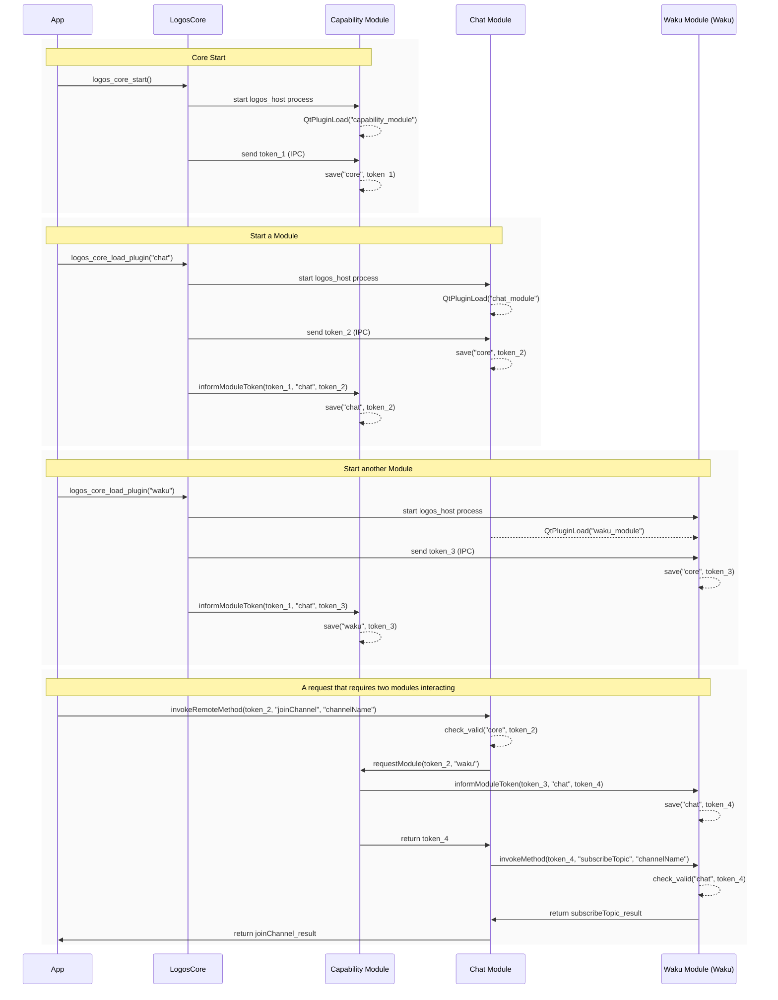

# Logos Core Platform Specification

note: This document is a living document and it explains the project's current state, though it may not necessarily reflect its intended & future design.

## Table of Contents

- [1. Overview and Goals](#1-overview-and-goals)
  - [Main Repository Components](#main-repository-components)
  - [Other Repository Components](#other-repository-components)
- [2. Architecture](#2-architecture)
  - [2.1 High-level Structure](#21-high-level-structure)
  - [2.2 Process Separation and IPC](#22-process-separation-and-ipc)
  - [2.3 Tokens and Authentication](#23-tokens-and-authentication)
- [3. API Description](#3-api-description)
  - [3.1 Core API Functions](#31-core-api-functions)
  - [3.2 SDK](#32-sdk)
    - [3.2.0 Basic Interaction](#320-basic-interaction)
    - [3.2.1 LogosAPI](#321-logosapi)
    - [3.2.2 LogosAPIProvider](#322-logosapiprovider)
      - [3.2.2.1 ModuleProxy (internal)](#3221-moduleproxy-internal)
    - [3.2.3 LogosAPIClient](#323-logosapiclient)
      - [3.2.3.1 LogosAPIConsumer (internal)](#5231-logosapiconsumer-internal)
    - [3.2.4 Generated C++ wrappers (logos_sdk)](#324-generated-c-wrappers-logos_sdk)
  - [3.3 Plugin Interface and Metadata](#33-plugin-interface-and-metadata)
  - [3.4 Core Modules](#34-core-modules)
    - [3.4.1 Capability Module](#341-capability-module)
    - [3.4.2 Core Manager](#342-core-manager)
  - [3.5 Other Modules](#35-other-modules)
    - [3.5.1 Package Manager](#351-package-manager)
    - [3.5.2 Waku Module](#352-waku-module)
    - [3.5.3 Chat](#353-chat)
    - [3.5.4 Logos IRC](#354-logos-irc)
    - [3.5.5 Wallet Module](#355-wallet-module)
- [4. Module Implementation](#4-module-implementation)
  - [4.1 Overview](#41-overview)
  - [4.2 Required Files](#42-required-files)
    - [Interface Header](#interface-header)
    - [Plugin Implementation](#plugin-implementation)
    - [Metadata File](#metadata-file)
    - [Build Configuration](#build-configuration)
- [5. Apps using Core](#5-apps-using-core)
  - [5.1 LogosApp Example](#51-logosapp-example)
  - [5.2 ChatApp Example](#52-chatapp-example)
  - [5.3 Electron Chat Example](#53-electron-chat-example)
  - [5.4 Nim App Example](#54-nim-app-example)
  - [5.5 Electron Wallet Example](#55-electron-wallet-example)
- [6. Sequence Flows](#6-sequence-flows)
  - [Full LifeCycle](#full-lifecycle)
- [7. Experimental](#7-experimental)
  - [7.1 Direct Core Library Usage in NodeJS & Electron](#71-direct-core-library-usage-in-nodejs--electron)
  - [7.2 Logos JS SDK](#72-logos-js-sdk)
    - [7.2.1 Future work: Use reflection for a better API experience](#721-future-work-use-reflection-for-a-better-api-experience)
  - [7.3 Nim SDK (Nim LogosAPI)](#73-nim-sdk-nim-logosapi)
- [8. Limitations, Future Improvements & Known Issues](#8-limitations-future-improvements--known-issues)
  - [8.1 Logos Host (ModuleHost)](#81-logos-host-modulehost)
  - [8.2 C++ SDK API Improvements & other improvements](#82-c-sdk-api-improvements--other-improvements)
  - [8.3 Code Generation](#83-code-generation)
- [9. Build and Run Scripts](#9-build-and-run-scripts)
  - [9.1 Setup](#91-setup)
  - [9.2 Build everything and run Logos App](#92-build-everything-and-run-logos-app)
  - [9.3 Run tests](#93-run-tests)
  - [9.4 Compiled only modules](#94-compiled-only-modules)
  - [9.5 Compiled only UI plugins](#95-compiled-only-ui-plugins)
  - [9.6 Build and run the core](#96-build-and-run-the-core)
  - [9.7 Library Path Adjustments](#97-library-path-adjustments)


## 1. Overview and Goals

Logos Core is a modular platform designed to host and interact with independently developed modules (plugins). The core library (`core/src`) and accompanying C++ SDK (`SDK/cpp`) provide a modular, plug-in-based runtime for decentralised applications. Each module implements a common interface and is launched in its own process for isolation. A software development kit (SDK) exposes a remote-procedure-call (RPC) mechanism so that modules, the core and external modules can call methods on each other or listen for events.

The core exposes an extensible API to load, start, stop and introspect plug-ins, and it wraps Qt Remote Objects to allow modules to call each other's methods asynchronously. The SDK supplies client and provider classes that abstract away remote-object registry and token management, enabling modules to perform RPC-like calls without needing to understand the underlying IPC mechanism

### Main Repository Components

| Component | Purpose |
|-----------|---------|
| `core/src` | C/C++ implementation of the core library: discovers, loads and manages modules, provides an API to list modules, load/unload them and call methods on them. |
| `SDK/cpp` | Client-side SDK that wraps RPC functionality. Modules link against this SDK to call the core and other modules. |
| `modules/` | Various Modules that can be loaded by the Core (e.g Waku) |
| `logos_app/app` | Example application that uses the core and modules. |
| `logos_app/logos_dapps` | UI Plugins for the example application |

### Other Repository Components

| Component | Purpose |
|-----------|---------|
| `tests/` | Simple applications meant to test functionality. |
| `scripts` | Various scripts to build the core, the example app, compile modules |
| `examples/` | Other example apps, still experimental |

## 2. Architecture

### 2.1 High-level Structure

At a high level Logos Core consists of the following collaborating parts:

**Core** – Discovers available modules and when instructed to launches them in separate processes, maintains a list of known and loaded modules, manages an inter-process remote-object registry and exposes a public API to load/unload modules or call methods. In the PoC, the core is implemented in C++ using Qt (C API in `logos_core.h`).

**Module (Plugin)** – A dynamically loaded component that implements a common `PluginInterface` and optionally exposes other methods to be called remotely. Each module registers itself with the core when loaded. Each module is a Qt Plugin

**Module Host** – A lightweight executable (`logos_host`) that loads a single module in its own process. It communicates with the core over a local socket to receive an authentication token and registers the module's object with the remote registry.

**SDK/CPP LogosAPI** – A client library used by modules and external applications to call methods on remote modules and to listen for events. It encapsulates connection management, token handling and asynchronous invocation. Key classes include `LogosAPI`, `LogosAPIProvider`, `LogosAPIClient`, `LogosAPIConsumer`, `ModuleProxy` and `TokenManager`.

**Remote Object Registry** – A registry that maintains a mapping of module names to remote object replicas and forwards method calls/events. In the PoC it is implemented using `QRemoteObjectRegistryHost` and `QRemoteObjectHost`. The core and each module maintain their own registry in which an object is exposed.

### 2.2 Process Separation and IPC

Each module runs in its own process to improve robustness and security. The core spawns a `logos_host` process per module and communicates via a local inter-process socket. After a module is authenticated, both processes use the remote-object registry to call methods or deliver events. This separation isolates faulty or untrusted modules and allows modules to be written in different languages as long as they implement the agreed RPC protocol.

### 2.3 Tokens and Authentication

Since `QRemoteObjectRegistryHost` has no built-in security mechanisms, by default it's not possible to know the origin of a request and if they are authorized. For this reason internally all remote calls require an authentication token, however this is done under the hood through the API and invisible for the developer when they are using the `LogosAPI` in their modules. When a module is loaded, the core generates a token and sends it to the module process. This way the module can authenticate calls that are coming from the core.
Then when modules need to communicate with each other, they request authorization from the Capability Module, which issues a token and notifies both. The modules then use this token for subsequent requests.
Each Module stores tokens in a thread-safe `TokenManager`, this is done internally and is transparent for the Developer.`ModuleProxy` validates tokens before dispatching method calls to the underlying module implementation.

## 3. API Description

### 3.1 Core API Functions

| Function | Purpose |
|----------|---------|
| `logos_core_initialize()` | Initializes global state and optionally sets the plugin directory. Creates a QCoreApplication if one does not exist and sets up the remote object registry host. |
| `logos_core_set_plugins_dir(path)` | Specifies where to look for modules. Must be called before starting. |
| `logos_core_start()` | Scans the plugin directory, processes metadata, creates the Core Manager module, loads the built-in capability module, and starts the remote object registry. This must be called before any modules can be used. |
| `logos_core_exec()` | Runs the Qt event loop. Returns when the application exits. |
| `logos_core_cleanup()` | Unloads all modules, stops processes and cleans up global state. |
| `logos_core_get_loaded_plugins()` | Returns a list of currently loaded modules (names). |
| `logos_core_get_known_plugins()` | Returns a list of all modules discovered, even if not loaded. |
| `logos_core_load_plugin(name)` | Loads a module by name. Starts a logos_host process, sends an auth token, waits for the module to register and records it as loaded. |
| `logos_core_unload_plugin(name)` | Terminates the module's process and removes it from loaded modules. |
| `logos_core_process_plugin(path)` | Reads a module file's metadata and adds it to the list of known modules without loading it. |
| `logos_core_get_token(moduleName)` | Returns the auth token associated with a module. (note: might be removed) |


**Experimental**

These are experimental APIs and currently being used by the examples that use NodeJS/Electron. Since apps using NodeJS do not have QT and therefore cannot easily use the QT Remote API directly, they can instead make the calls through the Core. Note that besides this initial call, all other calls between modules still happen directly between modules using Qt Remote and do not go through the core.

| Function                                                                                          | Purpose                                                                                                                                                                                                    |
| ------------------------------------------------------------------------------------------------- | ---------------------------------------------------------------------------------------------------------------------------------------------------------------------------------------------------------- |
| `logos_core_call_plugin_method_async(plugin_name, method_name, params_json, callback, user_data)` | Invokes a method on a loaded plugin asynchronously. Parses `params_json` array (`{name,value,type}`), connects via `LogosAPI`, calls `invokeRemoteMethod`, and returns result or error through `callback`. |
| `logos_core_register_event_listener(plugin_name, event_name, callback, user_data)`                | Registers an event listener on a plugin. Stores listener, waits for plugin readiness, attaches via `LogosAPI`, and triggers `callback` with event JSON (`{"event":"name","data":[...]}`) when emitted.     |
| `logos_core_process_events()`                                                                     | Processes Qt events without blocking (`g_app->processEvents()`), allowing integration with external event loops.                                                                                           |

### 3.2 SDK

The C++ SDK (SDK/cpp) wraps Qt Remote Objects and token management so that modules can register themselves and call other modules without dealing with sockets or the remote registry. The SDK exposes `LogosAPI` that owns a provider (`LogosAPIProvider`) and a cache of clients (`LogosAPIClient`) for different target modules. Internally it relies on a TokenManager to authenticate remote calls. The SDK is asynchronous: calls return immediately and results are delivered via callbacks/signals.

#### 3.2.0 Basic Interaction

When calling a method from another module, from the Developer perspective they simply do a call such as:

```c++
bool response = logosAPI->getClient("waku")->invokeRemoteMethod('waku', 'subscribeTopic');
```

or using the code generation functionality
```c++
bool response = logos.waku.subscribeTopic();
```

However under the hood the API abstracts things. In this case the call gets re-routed with the appropriate token and goes to a ModuleProxy object that wraps the actual Object. The ModuleProxy validates the call before forwarding it to the object method.



- `ModuleProxy` is exposed with `QRemoteObjectRegistryHost`
- The call between `LogosAPIClient` and `ModuleProxy` is made using `QRemoteObjectNode`

#### 3.2.1 LogosAPI

`LogosAPI` is the entry point for modules and applications. It encapsulates a single provider and a cache of clients and exposes methods to obtain these. A module creates one `LogosAPI` instance during initialisation and passes its own name to it. Internally the constructor constructs a new `LogosAPIProvider` and retrieves a reference to the singleton `TokenManager`. A `QHash` caches `LogosAPIClient` instances keyed by target module so repeated calls reuse the same client.

**Responsibilities**:
- Initialise and own a `LogosAPIProvider` and a `TokenManager`
- Create and cache `LogosAPIClient` objects for calling other modules
- Provide access to the provider and token manager through getters

`LogosAPI` hides the details of registry hosts and consumer connections. Module writers obtain a client via `getClient()` and then call remote methods through that client. They never deal directly with sockets or tokens; the API attaches tokens automatically on calls.

| Method                                                                    | Purpose                                                                                                                     |
| ------------------------------------------------------------------------- | --------------------------------------------------------------------------------------------------------------------------- |
| `explicit LogosAPI(const QString& moduleName, QObject *parent = nullptr)` | Constructs an API for `moduleName` and initialises a provider and token manager.                                            |
| `~LogosAPI()`                                                             | Destructor; child objects (provider, clients) are deleted automatically.                                                    |
| `LogosAPIProvider* getProvider() const`                                   | Returns the provider that modules use to register themselves for remote access.                                             |
| `LogosAPIClient* getClient(const QString& targetModule) const`            | Returns a client for calling `targetModule`.  If a client for that module does not yet exist, it creates one and caches it. |
| `TokenManager* getTokenManager() const`                                   | Returns the token manager used to store and validate authentication tokens.(note: this is meant to be internal but it's exposed for debug purposes)                                                |

#### 3.2.2 LogosAPIProvider

`LogosAPIProvider` runs on the module’s side and exposes local objects over the Qt Remote Objects registry. It owns a `QRemoteObjectRegistryHost` and a `ModuleProxy` that wraps the actual module instance. When a module calls `registerObject(name, object)`, the provider optionally calls `object->initLogos(LogosAPI*)` if that method exists, then wraps the object in a `ModuleProxy` and publishes it over the registry. Only one object can be registered per provider; additional attempts return false

**Responsibilities**:

- Create a registry host bound to `local:logos_<moduleName>` when the first object is registered. For example if the module name is `chat` then the registry host will be at `local:logos_chat`.
- Wrap the module in a `ModuleProxy` to enforce token validation and to forward events
- Enable remoting via Qt (enableRemoting) so that other modules can acquire a replica
- Forward event responses to remote subscribers by invoking `eventResponse` on their replica
- Save tokens received from other modules by delegating to the `ModuleProxy`

| Method                                                                                       | Purpose                                                                                                                                                                                                                                                        |
| -------------------------------------------------------------------------------------------- | -------------------------------------------------------------------------------------------------------------------------------------------------------------------------------------------------------------------------------------------------------------- |
| `explicit LogosAPIProvider(const QString& moduleName, QObject *parent = nullptr)`            | Constructs a provider; initialises registry URL `local:logos_<moduleName>`.                                                                                                                                                                                    |
| `~LogosAPIProvider()`                                                                        | Destructor; `QRemoteObjectRegistryHost` and `ModuleProxy` are deleted as children.                                                                                                                                                                             |
| `bool registerObject(const QString& name, QObject *object)`                                  | Registers `object` under `name`.  If the object defines `initLogos(LogosAPI*)` it is invoked first, then the object is wrapped in a `ModuleProxy` and exposed via the registry.  Only one registration per provider is allowed; subsequent calls return false. |
| `QString registryUrl() const`                                                                | Returns the provider’s registry URL.                                                                                                                                                                                                                           |
| `bool saveToken(const QString& fromModuleName, const QString& token)`                        | Persists a token for `fromModuleName` by delegating to the module proxy.                                                                                                                                                                                       |
| `void onEventResponse(QObject *replica, const QString& eventName, const QVariantList& data)` | Emits an event on the subscriber’s replica by invoking its `eventResponse` method.                                                                                                                                                                             |

**Usage Example**

This API is used internally (by the core or logos host) and is not meant to be used by the Developer directly.

```c++
QPluginLoader loader("waku_module.so");
QObject *wakuPlugin = loader.instance()
PluginInterface *baseWakuPlugin = qobject_cast<PluginInterface *>(wakuPlugin)
 
logos_api->getProvider()->registerObject(basePlugin->name(), baseWakuPlugin);
```

This will:
- Call `initLogos` if it exists and pass `LogosAPI` to the module
- Wrap `baseWakuPlugin` with `ModuleProxy`
- Expose the wrapped object with `QRemoteObjectRegistryHost` on `local:logos_<basePlugin->name()>`

#### 3.2.2.1 ModuleProxy (internal)

`ModuleProxy` is an internal class used by the provider to expose a module safely. It wraps the real module object and validates every incoming call against the stored authentication tokens. Each proxy keeps a map of tokens keyed by module name.

Modules never instantiate `ModuleProxy` directly; it is created by the provider and published through Qt Remote Objects. Remote callers interact with it implicitly via `LogosAPIClient` and `LogosAPIConsumer`.

**Responsibilities**:
- Validate the authentication token on every remote call. In `callRemoteMethod()` the proxy checks that a non‑empty token is provided and verifies it against the `TokenManager`. Calls with invalid or missing tokens return an empty `QVariant`.
- Dispatch method calls to the underlying module using Qt’s meta‑object system. The proxy locates the requested method by name and argument count, supports up to five arguments, and handles various return types including `void`, `bool`, `int`, `QString`, `QVariant`, `QJsonArray` and `QStringList`
- Introspect the wrapped module’s API via `getPluginMethods()`, returning a `QJsonArray` describing each method (name, signature, return type, parameters)
- Provide an `eventResponse` signal that the provider emits when events are forwarded to subscribers
- Store tokens issued by other modules via `saveToken(fromModuleName, token)`
- Allow a module or consumer to inform another module of a token via `informModuleToken(authToken, moduleName, token)`

| Method                                                                                                          | Purpose                                                                                                                             |
| --------------------------------------------------------------------------------------------------------------- | ----------------------------------------------------------------------------------------------------------------------------------- |
| `explicit ModuleProxy(QObject* module, QObject *parent = nullptr)`                                              | Wraps `module` for remote access.                                                                                                   |
| `QVariant callRemoteMethod(const QString& authToken, const QString& methodName, const QVariantList& args = {})` | Validates `authToken`, locates `methodName` on the module and invokes it.  Supports up to five arguments and multiple return types. This will forward the request to the wrapped object. |
| `bool informModuleToken(const QString& authToken, const QString& moduleName, const QString& token)`             | Stores `token` for `moduleName` in the global `TokenManager`. This is used by the core and capability module to let this module know that another module will communicate using a certain token,=.                                                                       |
| `QJsonArray getPluginMethods()`                                                                                 | Enumerates the wrapped module’s methods using Qt meta‑object introspection and returns a JSON array with signatures and parameters. |
| `eventResponse(QString eventName, QVariantList data)` (signal)                                                  | Emitted when the proxy forwards an event to subscribers.                                                                            |

Example: Listing methods of a module (from a consumer)

```c++
// Acquire the module's proxy (replica)
QObject* walletObj = api.getClient("wallet_module")->requestObject("wallet_module");

// Invoke the introspection method exposed by ModuleProxy
QRemoteObjectPendingCall pending;
QMetaObject::invokeMethod(walletObj, "getPluginMethods", Qt::DirectConnection,
                          Q_RETURN_ARG(QRemoteObjectPendingCall, pending));
pending.waitForFinished(20000);
QJsonArray methods = pending.returnValue().toJsonArray();
```

#### 3.2.3 LogosAPIClient

`LogosAPIClient` provides a high‑level, asynchronous interface for invoking methods on remote modules and subscribing to events. Each client is bound to a single target module and holds a `LogosAPIConsumer` to manage the underlying connection. The constructor takes the name of the module to talk to, the origin module name and a `TokenManager` pointer

`LogosAPIClient` should be used by modules to perform calls and event subscriptions. It hides the details of connecting, reconnection, token lookup, argument packaging and result deserialization.

**Responsibilities**:
- Manage the connection to the remote registry and acquire remote object replicas via the consumer
- Retrieve and attach authentication tokens for calls. Before every call, the client looks up the token for the target module and passes it to the consumer
- Provide convenience overloads of `invokeRemoteMethod()`` for 0–5 arguments, returning a `QVariant` result
- Register event listeners with optional callbacks and route event responses back to the origin module
- Forward token information to another module by calling `informModuleToken()` on the consumer

| Method                                                                                                                                                                                                                                          | Purpose                                                                                                                                                                      |
| ----------------------------------------------------------------------------------------------------------------------------------------------------------------------------------------------------------------------------------------------- | ---------------------------------------------------------------------------------------------------------------------------------------------------------------------------- |
| `explicit LogosAPIClient(const QString& moduleToTalkTo, const QString& originModule, TokenManager* tokenManager, QObject *parent = nullptr)`                                                                                                    | Constructs a client bound to `moduleToTalkTo`; internally creates a `LogosAPIConsumer`.                                                                                      |
| `QObject* requestObject(const QString& objectName, int timeoutMs = 20000)`                                                                                                                                                                      | Acquires a remote object replica by name through the consumer.                                                                                                               |
| `bool isConnected() const`                                                                                                                                                                                                                      | Returns whether the client’s consumer is connected to the registry.                                                                                                          |
| `QString registryUrl() const`                                                                                                                                                                                                                   | Returns the URL of the registry the client is connected to.                                                                                                                  |
| `bool reconnect()`                                                                                                                                                                                                                              | Reconnects to the registry by creating a new consumer node.                                                                                                                  |
| `QVariant invokeRemoteMethod(const QString& objectName, const QString& methodName, const QVariantList& args = {}, int timeoutMs = 20000)` and overloads for 1–5 arguments                                                                       | Calls `methodName` on `objectName` asynchronously.  Looks up the caller’s auth token and passes it to the consumer.  Returns the result or an invalid `QVariant` on failure. |
| `void onEvent(QObject* originObject, QObject* destinationObject, const QString& eventName, std::function<void(const QString&, const QVariantList&)> callback)`                                                                                  | Subscribes to `eventName` emitted by `originObject` and invokes `callback` when triggered.                                                                                   |
| `void onEvent(QObject* originObject, QObject* destinationObject, const QString& eventName)`                                                                                                                                                     | Subscribes to an event by connecting `originObject`’s `eventResponse` signal to `destinationObject`’s `onEventResponse` slot.                                                |
| `void onEventResponse(QObject* replica, const QString& eventName, const QVariantList& data)`                                                                                                                                                    | Internal helper; emits `eventResponse` on the replica when events arrive.                                                                                                    |
| `bool informModuleToken(const QString& authToken, const QString& moduleName, const QString& token)` and `bool informModuleToken_module(const QString& authToken, const QString& originModule, const QString& moduleName, const QString& token)` | Forwards a token to another module via the consumer.                                                                                                                         |
| `TokenManager* getTokenManager() const`                                                                                                                                                                                                         | Returns the token manager used by this client.                                                                                                                               |
| `QString getToken(const QString& moduleName)`                                                                                                                                                                                                   | Helper that retrieves the token for `moduleName` from the token manager.                                                                                                     |

**Usage**

This is the most common API that a module developer will use:

Calling a remote method:
```c++
logosAPI->getClient("chat")->invokeRemoteMethod("chat", "joinChannel", currentChannel);
```

Calling a remote method with multiple parameters:
```c++
logosAPI->getClient("chat")->invokeRemoteMethod("chat", "sendMessage", currentChannel, username, message)
```

note: Internally the API will take care of any token negotiation and permissions needed (see Sequence Diagram section)

Listening to Events from another object:

```c++
QObject *chatObject = m_logosAPI->getClient("chat")->requestObject("chat");

m_logosAPI->getClient("chat")->onEvent(chatObject, this, "chatMessage", [this](const QString &eventName, const QVariantList &data) {
          handleWakuMessage(data[0].toString().toStdString(), data[1].toString().toStdString(), data[2].toString().toStdString());
});
```

Listening to events from another module via the generated helpers:

```c++
LogosModules logos(m_logosAPI);

logos.chat.on("chatMessage", [this](const QVariantList& data) {
    handleWakuMessage(data.value(0).toString().toStdString(),
                      data.value(1).toString().toStdString(),
                      data.value(2).toString().toStdString());
});
```

Triggering an event:

```c++
QVariantList data;
data << timestamp << nick << message;

logosAPI->getClient("chat")->onEventResponse(this, "chatMessage", data);
```

Triggering an event with the generated helpers:

```c++
logos.chat.setEventSource(this);

QVariantList data;
data << timestamp << nick << message;

logos.chat.trigger("chatMessage", data);
```

#### 3.2.3.1 LogosAPIConsumer (internal)

`LogosAPIConsumer` is the low‑level component used by `LogosAPIClient`. It manages the connection to the registry, acquires remote object replicas and invokes methods via Qt Remote Objects. It also handles event subscription and token propagation. The constructor stores the registry URL `local:logos_<targetModule>` and attempts to connect immediately. A `LogosAPIClient` will have multiple `LogosAPIConsumer` instances.

`LogosAPIConsumer` should not be used directly by most developers; it is an implementation detail of `LogosAPIClient`. It provides fine‑grained control over remote calls and event handling and encapsulates the complexity of `QRemoteObjectNode`, replicas and pending calls.

**Responsibilities**:
- Manage a `QRemoteObjectNode` connection to the registry and reconnect when needed
- Acquire dynamic replicas of remote objects and wait for them to be ready within a timeout
- Invoke remote methods either via a `ModuleProxy` (if the replica is a proxy) or directly on the remote object using Qt’s `invokeMethod` and `QRemoteObjectPendingCall`
- Register event listeners: store callbacks per event and connect to the remote object’s `eventResponse` signal. When events arrive, `invokeCallback()`` iterates through all registered callbacks and invokes them
- Register simple event subscriptions by connecting the remote `eventResponse` signal directly to a destination slot
- Forward tokens to another module through a remote `informModuleToken` call on the module’s proxy and support informing tokens for modules loaded by the origin module

| Method                                                                                                                                                              | Purpose                                                                                                                                                                                                                              |
| ------------------------------------------------------------------------------------------------------------------------------------------------------------------- | ------------------------------------------------------------------------------------------------------------------------------------------------------------------------------------------------------------------------------------ |
| `explicit LogosAPIConsumer(const QString& moduleToTalkTo, const QString& originModule, TokenManager* tokenManager, QObject *parent = nullptr)`                      | Constructs the consumer, sets the registry URL and immediately calls `connectToRegistry()`.                                                                                                                                          |
| `~LogosAPIConsumer()`                                                                                                                                               | Destructor; disconnects stored connections and clears callbacks.                                                                                                                                                                     |
| `QObject* requestObject(const QString& objectName, int timeoutMs = 20000)`                                                                                          | Acquires a remote object replica and waits for it to be ready.  Returns `nullptr` on failure.                                                                                                                                        |
| `bool isConnected() const`                                                                                                                                          | Reports whether the consumer is connected to the registry.                                                                                                                                                                           |
| `QString registryUrl() const`                                                                                                                                       | Returns the registry URL.                                                                                                                                                                                                            |
| `bool reconnect()`                                                                                                                                                  | Reconnects by creating a new `QRemoteObjectNode` and calling `connectToRegistry()`.                                                                                                                                                  |
| `bool connectToRegistry()` (private)                                                                                                                                | Connects to the registry URL using `QRemoteObjectNode::connectToNode` and updates `m_connected`.                                                                                                                                     |
| `QVariant invokeRemoteMethod(const QString& authToken, const QString& objectName, const QString& methodName, const QVariantList& args = {}, int timeoutMs = 20000)` | Invokes a remote method.  If the replica is a `ModuleProxy`, calls its `callRemoteMethod()` with the provided token.  Otherwise it invokes `callRemoteMethod` on the replica and waits for the `QRemoteObjectPendingCall` to finish. |
| `void onEvent(QObject* originObject, QObject* destinationObject, const QString& eventName, std::function<void(const QString&, const QVariantList&)> callback)`      | Registers a callback for `eventName` by storing it and ensuring the connection to the origin object’s `eventResponse` signal.                                                                                                        |
| `void onEvent(QObject* originObject, QObject* destinationObject, const QString& eventName)`                                                                         | Registers an event listener without a callback by connecting `originObject->eventResponse` to the `destinationObject->onEventResponse` slot.                                                                                         |
| `void invokeCallback(const QString& eventName, const QVariantList& data)` (slot)                                                                                    | Invokes all callbacks registered for `eventName`.                                                                                                                                                                                    |
| `bool informModuleToken(const QString& authToken, const QString& moduleName, const QString& token)`                                                                 | Informs the capability module’s proxy about a token for `moduleName`.                                                                                                                                                                |
| `bool informModuleToken_module(const QString& authToken, const QString& originModule, const QString& moduleName, const QString& token)`                             | Informs a module loaded by `originModule` about a token via that module’s proxy.                                                                                                                                                     |

#### 3.2.4 Generated C++ wrappers (logos_sdk)

To simplify calling methods across modules with proper C++ types, a generator produces typed wrappers into `SDK/cpp/generated/` and an umbrella pair `logos_sdk.h`/`logos_sdk.cpp`. The umbrella aggregates one wrapper class per module and exposes them via a convenience struct `LogosModules`.

Usage:

```c++
#include "logos_sdk.h"

LogosAPI* api = new LogosAPI("core", this);
LogosModules logos(api);

bool ok = logos.chat.initialize();
logos.chat.joinChannel(currentChannel);
logos.chat.sendMessage(currentChannel, username, message);
logos.chat.on("chatMessage", [](const QVariantList& data) {
    qDebug() << "timestamp:" << data.value(0).toString();
});
logos.chat.setEventSource(this);
logos.chat.trigger("chatMessage", QVariantList{QDateTime::currentDateTime().toString(), "nick", "hello"});
```

`setEventSource()` stores the QObject that actually declares the `eventResponse(QString, QVariantList)` signal—typically the plugin instance itself. The wrapper uses that cached pointer when you call the shorthand `trigger(eventName, data)` so it can emit the signal on the correct sender. If you skip `setEventSource()`, use the explicit overload `trigger(eventName, QObject* source, ...)` to provide the emitting object each time.

Build integration (consumers of wrappers):
- Compile the umbrella source once per binary to avoid duplicate symbols: add `SDK/cpp/generated/logos_sdk.cpp` to your target sources.
- Add `SDK/cpp/generated` to your include paths.
- Wrappers are generated during the modules/app build by a custom step; see below.

CMake example (abbreviated):

```cmake
set(GENERATED_LOGOS_SDK_CPP ${CMAKE_CURRENT_SOURCE_DIR}/../../SDK/cpp/generated/logos_sdk.cpp)
set_source_files_properties(${GENERATED_LOGOS_SDK_CPP} PROPERTIES GENERATED TRUE)
target_sources(<your_target> PRIVATE ${GENERATED_LOGOS_SDK_CPP})
target_include_directories(<your_target> PRIVATE ${CMAKE_CURRENT_SOURCE_DIR}/../../SDK/cpp/generated)
```

Generator:
- Binary: `build/cpp-generator/bin/logos-cpp-generator` (built via `SDK/cpp-generator/compile.sh`).
- Typical invocation from CMake custom targets:
  - `logos-cpp-generator --metadata <path>/metadata.json --module-dir <path>/modules/build/modules`
- Outputs for each dependency module: `<module>_api.h/.cpp`, plus umbrella `logos_sdk.h/.cpp`.
- Always emits `core_manager_api.h/.cpp` and wires `CoreManager` into the umbrella even if the metadata does not list `core_manager`.  The core manager plug‑in is built into the core process and therefore cannot be introspected via `QPluginLoader`; generating it unconditionally guarantees SDK consumers can manage the core (initialise, enumerate plug‑ins, load/unload, etc.) without hand‑written bindings.
- Return types are mapped appropriately (e.g., `bool`, `int`, `double`, `float`, `QString`, `QStringList`, `QJsonArray`, or `QVariant`).

CLI flags and behavior:
- **--metadata <file>**: Path to a module's `metadata.json`. The generator parses the `dependencies` array to determine which modules to emit wrappers for.
- **--module-dir <dir>**: Directory containing built module plugins (e.g., `chat_plugin.so/.dylib`, `waku_module_plugin.*`). For each dependency, the generator loads the corresponding plugin to introspect its interface and generate wrappers.
- If only a plugin path is provided (without `--metadata`), the generator produces wrappers for that single plugin.
- Artifacts are written under the repository root’s `SDK/cpp/generated` directory and include: one `<module>_api.h/.cpp` per dependency and the umbrella `logos_sdk.h/.cpp` that aggregates them into `LogosModules`.

What it does under the hood:
- Loads each dependency plugin via `QPluginLoader`, creates an instance and enumerates its invokable methods using Qt meta‑object reflection.
- For each method, emits a type‑safe C++ wrapper function that marshals arguments and converts results from `QVariant` to the expected C++ types.
- Regenerates an umbrella header/source to include all generated module wrappers and expose a convenience aggregator `LogosModules` with members like `logos.chat` and `logos.core_manager`.

How code generation works (step‑by‑step):
1. Input resolution
   - If `--metadata` is provided, the generator parses the JSON and reads the `dependencies` array.
   - It combines each dependency name with a platform suffix (e.g., `_plugin.dylib` on macOS, `.so` on Linux, `.dll` on Windows) and looks for those plugin files under `--module-dir`.
   - If only a single plugin path is provided (no `--metadata`), it generates wrappers for that one plugin.
2. Plugin loading and introspection
   - Each target plugin is loaded with `QPluginLoader` and instantiated.
   - The generator walks the plugin instance’s Qt meta‑object (`QMetaObject`) to find invokable methods, capturing name, return type and parameters. This produces a method list the generator uses as its source of truth.
3. Header/source emission per module
   - The module name is converted to PascalCase for the wrapper class name (e.g., `chat` → `Chat`).
   - A header `<module>_api.h` declares a wrapper class with the typed method wrappers **and** convenience helpers for events (`on(...)`, `setEventSource(...)`, `trigger(...)`).
   - A source `<module>_api.cpp` implements each method by:
     - Packaging arguments into a `QVariantList` in order.
     - Invoking the remote method via the shared `LogosAPI`/client under the hood.
     - Converting the `QVariant` result to the declared return type using safe conversions (`toBool`, `toInt`, `toDouble`, `toFloat`, `toString`, `toStringList`, `qvariant_cast<QJsonArray>`), or returning the `QVariant` as‑is for generic cases.
4. Umbrella composition
   - `logos_sdk.h` includes all generated `*_api.h` files and defines a convenience aggregator:
     - `struct LogosModules { explicit LogosModules(LogosAPI* api); <Wrapper> <module_name>; ... }`.
   - `logos_sdk.cpp` includes all generated `*_api.cpp` sources.
   - Consumers compile `logos_sdk.cpp` exactly once per binary and include `logos_sdk.h` to access `logos.<module>.<method>(...)` across modules.
5. Build integration and idempotency
   - CMake custom targets call the generator before compiling modules/apps so `SDK/cpp/generated` is always up‑to‑date.
   - The `scripts/clean.sh` script deletes generated files (`*_api.h/.cpp`, `logos_sdk.h/.cpp`) while leaving the directory in place.
6. Scope and limitations
   - Wrapper method signatures use Qt types (`QString`, `QStringList`, `QJsonArray`, etc.). For unsupported/complex types, the return falls back to `QVariant`.
   - Event helpers ride on top of `LogosAPIClient::onEvent(...)`/`onEventResponse(...)`; call `setEventSource()` once before emitting events from a module.

### 3.3 Plugin Interface and Metadata

Every module must implement the Plugin Interface. In the PoC it is defined in C++ as an abstract class `PluginInterface` with the following API:

| Method | Description |
|--------|-------------|
| `name()` | Returns the module's unique name (string). |
| `version()` | Returns a version string. |
| `init(LogosAPI* api)` | (Not part of the interface but convention) Called on startup; gives access to the LogosAPI object used for RPC. |

**Signals**:
| Field | Type | Description |
|-------|------|-------------|
| `eventResponse(eventName, data)` | (QString, QVariantList) | Used for triggering events from this module. |

Additionally each module must provide a `metadata.json` file containing at least:

| Field | Type | Description |
|-------|------|-------------|
| `name` | string | Unique module identifier. |
| `version` | string | Semantic version. |
| `description` | string | Human readable description. |
| `author` | string | Author name/contact. |
| `type` | string | should always be `core` |
| `dependencies` | array | Names of other modules required. |
| `capabilities` | array | Capabilities provided. Future use. |
| `include` | array | Files that must be copied if available when installing this module. |

These fields are read by the core when processing a plugin file using `QPluginLoader`. The metadata file informs the core about dependencies and capabilities and is used to filter which modules can be loaded.

### 3.4 Core Modules

The Logos core comes with a few modules that are shipped alongside the core itself. These modules are just plugins from the core’s point of view – they are registered via the same `PluginInterface` and are loaded through the normal plug‑in mechanism – but they provide fundamental services that every Logos deployment relies on. Two such modules are the Capability Module and the Core Manager.
    
#### 3.4.1 Capability Module

The Capability Module is responsible for coordinating authentication tokens between modules. When one module wishes to call another module for the first time it does not yet have a valid token for the target. Instead of bypassing the token system, the caller asks the Capability Module to request the target. The capability module generates a fresh token, informs the target of the requesting module’s name and the new token, and returns that token to the caller. This ensures that both sides know the same secret and that subsequent remote calls can be validated by the target module’s `ModuleProxy` using the token manager. In practice the Capability Module acts like a capability broker and permission controller.
    
**Responsibilities**:
- **Token issuance for inter‑module calls**: When module A wants to call module B, it calls `requestModule(A, B)`` on the capability module. The capability module generates a random UUID token and asks module B to associate that token with module A. It then returns the token to module A so that it can authenticate remote calls
- **Informing modules of new tokens**: The capability module uses its own `LogosAPIClient` to invoke `informModuleToken_module` on the target module. It passes its own token for that module, the requesting module’s name and the new token. If the remote call succeeds the capability module logs success and returns the token to the caller
- **Centralised permission management**: While the proof‑of‑concept implementation always grants the request, the design is intended to evolve into a capability/permission manager that can enforce policies and record which modules are allowed to talk to each other. The metadata for the capability module identifies it as a security component and lists capabilities such as module_coordination and permission_management
    
**API**
The module implements a simple interface defined in `capability_module_interface.h` with a single remotely invokable method
    
| Method                                                | Purpose                                                                                                             | Implementation notes                                                                                                                                                                |
| ----------------------------------------------------- | ------------------------------------------------------------------------------------------------------------------- | ----------------------------------------------------------------------------------------------------------------------------------------------------------------------------------- |
| `requestModule(fromModuleName, moduleName) → QString` | Returns an authentication token that allows the caller (`fromModuleName`) to call the target module (`moduleName`). | Generates a UUID, asks the token manager for its own token for the target, calls `informModuleToken_module()` on the target with that token and the new UUID, and returns the UUID. |

#### 3.4.2 Core Manager

The Core Manager is a built‑in module that exposes the core’s lifecycle and plugin management functions over the same RPC mechanism.

It implements the general `PluginInterface` and registers itself under the name core_manager. Applications or other modules can call into the Core Manager to start the core, set the plug‑in directory, load or unload modules and introspect module methods without linking against the C API. This makes it possible to manage the core entirely through RPC.

Because the Core Manager lives inside the core process and is not deployed as a standalone plugin binary, `logos-cpp-generator` cannot introspect it at build time. Instead, the generator always emits a pre-defined `CoreManager` wrapper and adds it to the `LogosModules` umbrella so SDK consumers consistently have typed access to lifecycle and plugin-management APIs.

**Responsibilities**:
- **Core lifecycle control**: The core manager exposes `initialize()`, `setPluginsDirectory()`, `start()` and `cleanup()` methods which internally call the corresponding C API functions (`logos_core_set_plugins_dir`, `logos_core_start`, `logos_core_cleanup`) to set up and shut down the core
- **Plugin discovery and status**: `getLoadedPlugins()` returns the names of currently loaded modules by calling `logos_core_get_loaded_plugins()`. `getKnownPlugins()` builds a JSON array containing every discovered plug‑in with a loaded boolean by combining the `logos_core_get_known_plugins()` list with the loaded set
- **Plugin management**: `loadPlugin(pluginName)` and `unloadPlugin(pluginName)` wrap the C API functions `logos_core_load_plugin` and `logos_core_unload_plugin` and return whether the operation succeeded. `processPlugin(filePath)` reads a plug‑in file, processes its metadata via `logos_core_process_plugin` and returns the module’s name
- **Introspection**: Prefer calling `getPluginMethods()` directly on a module’s `ModuleProxy` (remote replica) to enumerate the wrapped module’s methods via Qt meta‑object introspection. A JSON array is returned with each method’s signature, name, return type and parameters. The Core Manager’s own `getPluginMethods(pluginName)` may still exist but is no longer required for introspection use‑cases.

**API**
The `CoreManagerInterface` defines the functions that the module exposes. The implementation in `CoreManagerPlugin` adds additional convenience methods such as `getKnownPlugins()` and `getPluginMethods()` and implements each call by delegating to the core or using the SDK.

| Method                                      | Purpose                                                                                                  | Notes                                                |
| ------------------------------------------- | -------------------------------------------------------------------------------------------------------- | ---------------------------------------------------- |
| `initialize(argc, argv)`                    | Prepare the module; currently a no‑op since the main application already creates the `QCoreApplication`. | Reserved for future integration.                     |
| `setPluginsDirectory(directory)`            | Set the directory where the core should look for modules.  Calls `logos_core_set_plugins_dir`.           | Must be called before `start()`.                     |
| `start()`                                   | Start the core’s remote object registry and load the built‑in modules by calling `logos_core_start`.     | Required before loading other modules.               |
| `cleanup()`                                 | Unload all modules and shut down the core via `logos_core_cleanup`.                                      | Should be called before application exit.            |
| `getLoadedPlugins() → QStringList`          | Return a list of names of currently loaded modules.                                                      | Uses `logos_core_get_loaded_plugins`.                |
| `getKnownPlugins() → QJsonArray`            | Return a JSON array of all known modules with a `loaded` flag.                                           | Combines discovery and load status.                  |
| `loadPlugin(pluginName) → bool`             | Load a plug‑in by name via `logos_core_load_plugin`.                                                     | Returns true on success.                             |
| `unloadPlugin(pluginName) → bool`           | Unload a plug‑in by name via `logos_core_unload_plugin`.                                                 | Returns true on success.                             |
| `processPlugin(filePath) → QString`         | Read a plug‑in file’s metadata and register it as known via `logos_core_process_plugin`.                 | Returns the module name or an empty string on error. |
| `getPluginMethods(pluginName) → QJsonArray` | Introspect a module’s methods using `LogosAPIClient` and Qt meta‑object introspection.                   | Optional. Prefer `ModuleProxy::getPluginMethods()` remotely. |
| `initLogos(logosAPIInstance)`               | Store the provided `LogosAPI` pointer so the module can call other modules.                              | Should be called before introspection functions.     |

### 3.5 Other Modules

These modules are examples of how to build services on top of the Logos API and often act as bridges to external protocols or provide convenience around plug‑in management.

#### 3.5.1 Package Manager

The Package Manager module is responsible for installing and listing third‑party plug‑ins. It exposes an API that allows applications or users to copy a plug‑in file into the core’s plug‑in directory and process its metadata so that it becomes a known plug‑in. The module also provides a way to enumerate the contents of a packages directory to display available plug‑ins and their metadata.

Currently this module takes a simple approach, it assumes the existing packages exist in a particular directory, and installs them by simply copying them to the directory the core can load them. In theory the plugin can be replaced by something more complex, for example `getPackages` can get the packages from a p2p network, and `installPlugin` download the package from a p2p network.
    
**Responsibilities**:
- **Installing plug‑ins**: `installPlugin(pluginPath)` verifies that the given file exists, ensures that the plug‑in directory exists (creating it if necessary), copies the plug‑in file and any additional files specified in its metadata to the plug‑in directory, and then calls the core via the core_manager module to process the plug‑in’s metadata. If processing succeeds it returns true, otherwise false.
- **Listing installed packages**: `getPackages()` scans the application’s packages directory, loads each dynamic library’s metadata using `QPluginLoader`, extracts fields such as name, version, description, category and dependencies, and returns a JSON array of package objects. This makes it easy for UIs to display available extensions.

**API**
The `PackageManagerInterface` defines a single method for installation, and the implementation adds an additional `getPackages()` convenience function.

| Method                             | Purpose                                                                                                                                                             | Notes                                                                   |
| ---------------------------------- | ------------------------------------------------------------------------------------------------------------------------------------------------------------------- | ----------------------------------------------------------------------- |
| `installPlugin(pluginPath) → bool` | Copy a plug‑in file to the configured plug‑in directory, copy any included files and process the plug‑in via `core_manager.processPlugin()`.                        | Returns `true` if the plug‑in was installed and processed successfully. |
| `getPackages() → QJsonArray`       | Enumerate `.so/.dll/.dylib` files in the `packages` directory, read their metadata via `QPluginLoader` and return an array of JSON objects describing each package. | Not part of the interface; provided for convenience.                    |
| `initLogos(logosAPI)`              | Store the `LogosAPI` pointer for later use.  Required before calling methods on `core_manager`.                                                                     | Called automatically by the core during plug‑in initialisation.         |

#### 3.5.2 Waku Module

The Waku Module wraps a libwaku library (nwaku) and exposes functions to configure, start and interact with a Waku node. Other modules, such as the Chat module, depend on this service to publish and subscribe to messages over Waku. This module contains nwaku as a git submodule, and compiles nwaku to use libwaku.so

**Responsibilities**:
- **Initialisation**: `initWaku(cfg)` creates a new Waku context using the supplied JSON configuration by calling waku_new and stores the resulting handle. `startWaku()` starts the Waku node asynchronously via `waku_start` and reports whether the start succeeded
- **Event delivery**: `setEventCallback()` registers a callback with the Waku library (`waku_set_event_callback`) so that incoming messages trigger the module’s static event_callback function. That callback packages the message and a timestamp into a QVariantList and forwards it to subscribers via `LogosAPI::onEventResponse()`
- **Relay messaging**: `relaySubscribe(pubSubTopic)` subscribes the node to a pub/sub topic using `waku_relay_subscribe`, while `relayPublish(pubSubTopic, jsonWakuMessage)` publishes a JSON‑encoded message to a topic via `waku_relay_publish`
- **Filter and store**: `filterSubscribe(pubSubTopic, contentTopics)` subscribes to messages matching specific content topics using the filter protocol, and `storeQuery(jsonQuery, peerAddr)` executes a historical query via `waku_store_query` to retrieve stored messages. When a store query completes, the module triggers a `storeQueryResponse` event with the results

**API**
The WakuModuleInterface defines the following remotely invokable methods. Each returns a boolean indicating whether the operation was successfully initiated.

**Metadata**
The Waku module is identified as a protocol module; its metadata has a `include` value with a list of shared library files (libwaku.so, .dylib and .dll) that must be copied alongside the plug‑in. These files are copied by the package manager when installing the module.

#### 3.5.3 Chat

The Chat module provides a simple chat service built on top of the Waku module. It exposes methods to initialise the chat runtime, join a channel, send messages and retrieve chat history. Internally it uses a helper library defined in `chat_api.h` to interact with the Waku node and handle message encoding/decoding.

Responsibilities
- **Initialisation**: `initialize()` creates a callback that packages incoming chat messages into a `QVariantList` and forwards them to subscribers via the Logos API. It calls `initAndStart()` from the chat API to initialise and start the chat backend, passing the current Waku relay topic and the callback
- **Joining channels**: `joinChannel(channelName)` instructs the chat API to join the specified channel using the current relay topic. This method returns a boolean to indicate success.
- **Sending messages**: `sendMessage(channelName, username, message)` forwards the message to the chat API, which encodes and publishes it via the Waku module. Messages are logged for debugging purposes.
- **Retrieving history**: `retrieveHistory(channelName)` triggers a store query through the chat API to fetch historic messages. A message callback packages each returned message into a QVariantList and triggers a historyMessage event via the Waku module.
- **Dependency on Waku**: All chat operations rely on a `LogosAPIClient` for the waku_module to publish, subscribe and retrieve messages. The chat module therefore lists waku_module as a dependency in its metadata

**API**
The `ChatInterface` defines the chat API. The plugin adds a convenience overload of retrieveHistory that accepts a QString for QML friendliness.

| Method                                        | Purpose                                                       | Notes                                                   |
| --------------------------------------------- | ------------------------------------------------------------- | ------------------------------------------------------- |
| `initialize() → bool`                         | Initialise the chat runtime and start listening for messages. | Returns `true` if the backend was successfully started. |
| `joinChannel(channelName) → bool`             | Join a chat channel via the Waku module.                      | Channel names are plain strings; no `#` prefix.         |
| `sendMessage(channelName, username, message)` | Publish a message to a channel.                               | Sends the message via the Waku module.                  |
| `retrieveHistory(channelName) → bool`         | Request the message history for a channel.                    | Emits `historyMessage` events as results arrive.        |
| `initLogos(logosAPI)`                         | Store the `LogosAPI` pointer for later use.                   | Must be called before other methods.                    |

#### 3.5.4 Logos IRC

The Logos IRC module implements a small IRC server that bridges between IRC clients and the chat module. It allows IRC users to join channels and chat with participants on the Waku network via the chat module. The module runs an embedded IRC server, connects to the chat module via `LogosAPIClient`, and forwards messages and join events in both directions.

**Responsibilities**:
- **Starting the IRC server**: When the plugin is constructed it creates an IRCServer instance, connects its signals and attempts to listen on 0.0.0.0:6667. If the server starts successfully it logs a message; otherwise it warns
- **Bridging Waku to IRC**: The plugin calls `initChatBridge()` when `initLogos()` is invoked . It requests the chat object via `LogosAPI`, subscribes to `chatMessage` and `historyMessage` events, and calls the chat module’s `initialize()` method. When chat messages arrive, the plugin prefixes the sender with `[WAKU]` or `[HISTORY][WAKU]` and injects the message into all joined IRC channels using `IRCServer::injectBridgeMessage()`
- **Bridging IRC to Waku**: The plugin listens to IRCServer signals for `channelJoined` and `messageSent`. When an IRC user joins a channel, the plugin calls `chat.joinChannel()` via RPC and fetches its history. When a message is sent in IRC it calls `chat.sendMessage()` on the chat module

**API**
The LogosIRCInterface currently defines no public methods as it's not meant to be called by other modules and simply starts the IRC Server when the Module starts.

| Method                | Purpose                                                                                                                | Notes                                                |
| --------------------- | ---------------------------------------------------------------------------------------------------------------------- | ---------------------------------------------------- |
| `initLogos(logosAPI)` | Store the `LogosAPI` pointer, start the chat bridge and prepare the IRC server to forward messages.                    | Must be called before the IRC/chat bridge is active. |

#### 3.5.5 Wallet Module

_note: this module is still under active development and the current APIs are purely for testing_

The Wallet Module provides blockchain wallet functionality by wrapping the GoWalletSDK C library. It enables applications to interact with Ethereum-compatible blockchains, retrieve account balances, and perform wallet operations. The module uses a Go-based wallet SDK compiled as a shared library (`libgowalletsdk`) that exposes blockchain functionality through a C API.

**Responsibilities**:
- **Wallet initialization**: `initWallet(configJson)` creates a new wallet client connected to an Ethereum RPC endpoint using the GoWalletSDK. It establishes a connection handle that is used for subsequent operations
- **Chain information**: `chainId(rpcUrl)` retrieves the chain ID of the connected blockchain network, which is essential for transaction signing and network identification
- **Balance queries**: `getEthBalance(rpcUrl, address)` fetches the native ETH balance for a given Ethereum address by querying the blockchain through the RPC connection
- **Token balance queries**: `getErc20Balances(rpcUrl, address, tokenAddresses)` is designed to retrieve ERC-20 token balances for multiple token contracts (currently stubbed for future implementation)
- **Resource management**: The module properly manages the wallet client handle lifecycle, creating it on initialization and cleaning it up on destruction to prevent memory leaks

**Technical Implementation**:
The module integrates with the GoWalletSDK through C FFI (Foreign Function Interface). The Go SDK is compiled to a shared library that exposes C-compatible functions for wallet operations. The module handles string conversion between Qt's QString and C strings, error handling from the Go layer, and proper memory management for C strings returned by the Go SDK.

**API**
The `WalletModuleInterface` defines the wallet operations available to other modules. The implementation automatically initializes the wallet client if needed when operations are called.

| Method                                                                        | Purpose                                                                                           | Notes                                                      |
| ----------------------------------------------------------------------------- | ------------------------------------------------------------------------------------------------- | ---------------------------------------------------------- |
| `initWallet(configJson) → bool`                                              | Initialize the wallet client with the given configuration (currently uses hardcoded RPC URL).    | Returns `true` if the client was successfully created.    |
| `chainId(rpcUrl) → QString`                                                   | Retrieve the chain ID of the connected blockchain network.                                        | Auto-initializes wallet client if not already done.       |
| `getEthBalance(rpcUrl, address) → QString`                                    | Get the native ETH balance for the specified Ethereum address.                                    | Returns balance as a string in wei units.                 |
| `getErc20Balances(rpcUrl, address, tokenAddresses) → QString`                | Get ERC-20 token balances for multiple token contracts.                                           | Currently not implemented; returns empty string.          |
| `initLogos(logosAPI)`                                                         | Store the `LogosAPI` pointer for inter-module communication.                                      | Called automatically during module initialization.         |

**Metadata**
The Wallet module metadata identifies it as a wallet category module and includes the GoWalletSDK shared libraries (`libgowalletsdk.so`, `.dylib`, `.dll`) in the `include` field. These libraries are copied alongside the plugin when installed via the package manager.

## 4. Module Implementation

### 4.1 Overview

A complete module consists of four essential components:

1. **Interface Header** - Defines the module's public API contract
2. **Plugin Implementation** - Concrete implementation of the interface
3. **Metadata File** - Describes module properties and dependencies
4. **Build Configuration** - CMakeLists.txt for compilation

All modules must inherit from `PluginInterface` (found at `core/interface.h`) and implement the required lifecycle methods (`name()`, `version()`, `initLogos()`) and include the `eventResponse` signal for events. Methods exposed to other modules must be marked with `Q_INVOKABLE` to enable Qt's meta-object system to invoke them across process boundaries.

### 4.2 Required Files
    
#### Interface Header

The interface header defines your module's public API contract. It must inherit from `PluginInterface` and declare all methods that other modules can invoke remotely.

**Key Requirements:**
- Inherit from `PluginInterface` (provides `name()`, `version()`, `initLogos()`)
- Mark all public methods with `Q_INVOKABLE` for remote access
- Include `eventResponse` signal for event forwarding
- Use `Q_DECLARE_INTERFACE` macro for Qt's plugin system

```c++
// MyModuleInterface.h
#pragma once
#include <QtCore/QObject>
#include <QtCore/QJsonArray>
#include <QtCore/QStringList>
#include "interface.h"

class MyModuleInterface : public PluginInterface {
public:
    virtual ~MyModuleInterface() {}
    
    // Public API methods - must be Q_INVOKABLE for remote access
    Q_INVOKABLE virtual void doSomething(const QString &param) = 0;
    Q_INVOKABLE virtual QString processData(const QString &input) = 0;
    Q_INVOKABLE virtual QJsonArray getStatus() = 0;

    Q_INVOKABLE void initLogos(LogosAPI* logosAPIInstance);

signals:
    // Required for event forwarding between modules
    void eventResponse(const QString &eventName, const QVariantList &data);
};

// Register interface with Qt's meta-object system
#define MyModuleInterface_iid "org.logos.MyModuleInterface"
Q_DECLARE_INTERFACE(MyModuleInterface, MyModuleInterface_iid)
```

#### Plugin Implementation

The plugin class provides the concrete implementation of your interface. It must inherit from both `QObject` and your custom interface to enable Qt's plugin and remote object systems.

**Key Requirements:**
- Inherit from `QObject` and your interface
- Use `Q_PLUGIN_METADATA` with proper IID and metadata file
- Register interface with `Q_INTERFACES` macro
- Implement all pure virtual methods from the interface
- Store and use `LogosAPI*` for inter-module communication

```c++
// MyModulePlugin.h
#pragma once
#include <QtCore/QObject>
#include <QtCore/QJsonArray>
#include <QtCore/QTimer>
#include "MyModuleInterface.h"
#include "logos_api.h"
#include "logos_api_client.h"
#include "logos_sdk.h"

class MyModulePlugin : public QObject, public MyModuleInterface {
    Q_OBJECT
    Q_PLUGIN_METADATA(IID MyModuleInterface_iid FILE "metadata.json")
    Q_INTERFACES(MyModuleInterface PluginInterface)

public:
    MyModulePlugin();
    ~MyModulePlugin();

    // PluginInterface implementation
    QString name() const override { return "my_module"; }
    QString version() const override { return "1.0.0"; }

    void MyModulePlugin::initLogos(LogosAPI* logosAPIInstance) {
        logosAPI = logosAPIInstance;
        logos = new LogosModules(logosAPI); // generated wrappers aggregator
        logos->core_manager.setEventSource(this); // enable trigger() helper
    }

    // Custom API implementation
    Q_INVOKABLE void doSomething(const QString &param) override {
        QString result = QString("Processed: %1").arg(param);
        QDateTime timestamp = QDateTime::currentDateTime();


        QVariantList eventData;
        eventData << result << timestamp.toString();
        logos->core_manager.trigger("dataProcessed", eventData);
    }

    Q_INVOKABLE QString processData(const QString &input) override {
        if (input.isEmpty()) {
            emit errorOccurred("Empty input provided", 1);
            return QString();
        }
        
        QString result = QString("Processed: %1").arg(input);
    
        // example: call another module using generated wrappers
        // pattern: logos.<module>.<method>(...)
        // e.g., logos->chat.sendMessage(channel, nick, result);

        // example subscribing to an event through the generated helper
        logos->chat.on("chatMessage", [this](const QVariantList& data) {
            qDebug() << data.value(0).toString();
        });

        return result;
    }
    
    Q_INVOKABLE QJsonArray getStatus() override {
        QJsonArray status;
        status.append(QJsonObject{
            {"active", true}, 
            {"connections", m_connections},
            {"subscribers", m_eventSubscribers.size()}
        });
        return status;
    }

```
    
#### Metadata File

Every module requires a `metadata.json` file that describes the module's properties, dependencies, and capabilities. This file is referenced by the `Q_PLUGIN_METADATA` macro and used by the core for module discovery and dependency resolution.

**Required Fields:**
- `name`: Unique module identifier (must match the value returned by `name()`)
- `version`: Semantic version string
- `description`: Human-readable description
- `author`: Module author or organization
- `type`: Module type (always "core" for this PoC)
- `category`: Module category for organization
- `main`: Main plugin class name
- `dependencies`: Array of required module names
- `capabilities`: Array of capabilities this module provides

**Example metadata.json:**
```json
{
  "name": "my_module",
  "version": "1.0.0",
  "description": "Example module demonstrating the plugin API",
  "author": "Logos Core Team",
  "type": "core",
  "category": "utility",
  "main": "my_module_plugin",
  "dependencies": ["core_manager"],
  "capabilities": ["data_processing", "event_handling"],
  "include": ["external_lib.so", "resources/"]
}
```

The core scans for metadata.json files during startup and validates dependencies before loading modules.

#### Build Configuration

Each module needs a `CMakeLists.txt` file to compile into a shared library. The build system must produce a `.so` (Linux), `.dylib` (macOS), or `.dll` (Windows) file that the core can dynamically load.

**Example CMakeLists.txt:**
```cmake
cmake_minimum_required(VERSION 3.16)
project(my_module)

# Find required Qt components
find_package(Qt6 REQUIRED COMPONENTS Core RemoteObjects)

# Enable Qt's automoc for meta-object code generation
set(CMAKE_AUTOMOC ON)

# Define the module as a shared library
add_library(my_module SHARED
    MyModulePlugin.cpp
    MyModulePlugin.h
    MyModuleInterface.h
)

# Optional: generate and consume typed wrappers (logos_sdk)
set(CPP_GENERATOR "${CMAKE_SOURCE_DIR}/../build/cpp-generator/bin/logos-cpp-generator")
set(REPO_ROOT "${CMAKE_SOURCE_DIR}/..")
set(PLUGINS_OUTPUT_DIR "${CMAKE_BINARY_DIR}/modules")
set(METADATA_JSON "${CMAKE_CURRENT_SOURCE_DIR}/metadata.json")

add_custom_target(run_cpp_generator_my_module
    COMMAND "${CPP_GENERATOR}" --metadata "${METADATA_JSON}" --module-dir "${PLUGINS_OUTPUT_DIR}"
    WORKING_DIRECTORY "${REPO_ROOT}"
    COMMENT "Running logos-cpp-generator for my_module"
    VERBATIM
)

# If your module calls other modules via generated wrappers, include the umbrella once
set(GENERATED_LOGOS_SDK_CPP ${CMAKE_CURRENT_SOURCE_DIR}/../../SDK/cpp/generated/logos_sdk.cpp)
set_source_files_properties(${GENERATED_LOGOS_SDK_CPP} PROPERTIES GENERATED TRUE)
target_sources(my_module PRIVATE ${GENERATED_LOGOS_SDK_CPP})
target_include_directories(my_module PRIVATE ${CMAKE_CURRENT_SOURCE_DIR}/../../SDK/cpp/generated)
add_dependencies(my_module run_cpp_generator_my_module)

# Link Qt libraries
target_link_libraries(my_module
    Qt6::Core
    Qt6::RemoteObjects
)

# Set target properties
set_target_properties(my_module PROPERTIES
    CXX_STANDARD 17
    CXX_STANDARD_REQUIRED ON
    VERSION ${CMAKE_PROJECT_VERSION}
    SOVERSION 1
)

# Install the shared library to the modules directory
install(TARGETS my_module
    LIBRARY DESTINATION modules
    RUNTIME DESTINATION modules
)

# Install metadata file
install(FILES metadata.json
    DESTINATION modules
)
```

### 4.3 Plugin Development Gotchas and Best Practices

This section covers common issues and best practices when developing plugins, particularly around library dependencies and runtime loading.

#### 4.3.1 External Library Dependencies and Runtime Loading

**Problem**: When your plugin depends on external shared libraries (`.so`, `.dylib`, `.dll`), the dynamic loader must be able to find these libraries at runtime. Common issues include:

1. **Absolute paths in binaries**: Libraries compiled with absolute paths won't work when deployed to different systems
2. **Missing library search paths**: The plugin can't find its dependencies when loaded by the core
3. **Install name issues on macOS**: Libraries with incorrect install names cause loading failures

##### macOS Library Path Handling

On macOS, use `@rpath` for portable library references. Here's the pattern used in the wallet module:

```cmake
if(APPLE)
    # Set proper rpath for the plugin
    set_target_properties(my_module_plugin PROPERTIES
        INSTALL_RPATH "@loader_path"
        INSTALL_NAME_DIR "@rpath"
        BUILD_WITH_INSTALL_NAME_DIR TRUE)

    # If you have external libraries to copy and fix
    if(EXTERNAL_LIB_PATH)
        # Copy the library to the build directory
        add_custom_command(TARGET my_module_plugin PRE_LINK
            COMMAND ${CMAKE_COMMAND} -E copy_if_different
            ${EXTERNAL_LIB_PATH}
            ${CMAKE_BINARY_DIR}/modules/libexternal.dylib
            COMMENT "Copying external library to modules directory"
        )

        # Fix install names after build using a CMake script
        add_custom_command(TARGET my_module_plugin POST_BUILD
            COMMAND install_name_tool -id "@rpath/my_module_plugin.dylib" $<TARGET_FILE:my_module_plugin>
            COMMAND ${CMAKE_COMMAND} -DLIB_PATH=${CMAKE_BINARY_DIR}/modules/libexternal.dylib 
                    -DPLUGIN_PATH=${CMAKE_BINARY_DIR}/modules/my_module_plugin.dylib 
                    -P ${CMAKE_CURRENT_SOURCE_DIR}/fix_install_names.cmake
            COMMENT "Updating library paths for macOS"
        )
    endif()
endif()
```

Create a `fix_install_names.cmake` script:
```cmake
# fix_install_names.cmake
if(EXISTS "${LIB_PATH}")
    message(STATUS "Fixing install name for external library: ${LIB_PATH}")
    execute_process(
        COMMAND install_name_tool -id "@rpath/libexternal.dylib" "${LIB_PATH}"
        RESULT_VARIABLE result
    )
    if(result)
        message(WARNING "Failed to update install name for external library")
    endif()
    
    # Update plugin to reference the library with @rpath
    execute_process(
        COMMAND install_name_tool -change "/old/absolute/path/libexternal.dylib" "@rpath/libexternal.dylib" "${PLUGIN_PATH}"
        RESULT_VARIABLE result
    )
    if(result)
        message(WARNING "Failed to update library reference in plugin")
    endif()
else()
    message(STATUS "External library not found, skipping install name update")
endif()
```

##### Linux Library Path Handling

On Linux, use `$ORIGIN` for relative library paths:

```cmake
else() # Linux
    # Set rpath to look in the same directory as the plugin
    set_target_properties(my_module_plugin PROPERTIES
        INSTALL_RPATH "$ORIGIN"
        INSTALL_RPATH_USE_LINK_PATH FALSE)

    # Copy external library if it exists
    if(EXTERNAL_LIB_PATH)
        add_custom_command(TARGET my_module_plugin PRE_LINK
            COMMAND ${CMAKE_COMMAND} -E copy_if_different
            ${EXTERNAL_LIB_PATH}
            ${CMAKE_BINARY_DIR}/modules/libexternal.so
            COMMENT "Copying external library to modules directory"
        )
    endif()
endif()
```

#### 4.3.2 Testing Library Dependencies

Before deploying your plugin, verify that library dependencies are correctly resolved:

**macOS**:
```bash
# Check what libraries your plugin depends on
otool -L your_plugin.dylib

# Check the install name of a library
otool -D your_library.dylib

# Verify @rpath resolution
install_name_tool -id "@rpath/your_library.dylib" your_library.dylib
```

**Linux**:
```bash
# Check library dependencies
ldd your_plugin.so

# Check rpath settings
readelf -d your_plugin.so | grep RPATH
```

## 5. Apps using Core

### 5.1 LogosApp Example

```c++
#include "logos_api.h"

extern "C" {
    void logos_core_set_plugins_dir(const char* path);
    void logos_core_start();
    void logos_core_process_plugin(const char* file);
    int  logos_core_load_plugin(const char* name);
    void logos_core_cleanup();
}

int main(int argc, char *argv[]) {
    QApplication app(argc, argv);

    // 1. Set plugin dir – points to bin/modules next to the app
    QString pluginsDir = QDir::cleanPath(QCoreApplication::applicationDirPath()+"/bin/modules");
    logos_core_set_plugins_dir(pluginsDir.toUtf8().constData());   

    // 2. Start the core (spawns built‑in modules, registry etc.)
    logos_core_start();                                           

    // 3. (Optional) Preload package_manager plugin
    QString pluginPath = pluginsDir + "/package_manager_plugin" + pluginExtension;
    logos_core_process_plugin(pluginPath.toUtf8().constData());   
    logos_core_load_plugin("package_manager");                     

    // 4. Create a LogosAPI instance for this app
    LogosAPI logosAPI("core");

    // 5. Pass LogosAPI* into a QMainWindow that will load the UI plug‑in
    Window w(&logosAPI);  // Window loads plugins/main_ui… see below
    w.show();

    int ret = app.exec();
    logos_core_cleanup();
    return ret;
}
```

In `Window::setupUi()` the app loads a UI plug‑in at runtime:

```c++
// Determine shared library suffix and build path to main_ui.so/.dll/.dylib
QString pluginPath = QCoreApplication::applicationDirPath() + "/plugins/main_ui" + pluginExtension;

// Load plug‑in with QPluginLoader and create widget via IComponent::createWidget(LogosAPI*)
QPluginLoader loader(pluginPath);
QObject *plugin = loader.load() ? loader.instance() : nullptr;
QWidget *mainContent = nullptr;
QMetaObject::invokeMethod(plugin, "createWidget", Q_RETURN_ARG(QWidget*, mainContent),
                          Q_ARG(LogosAPI*, m_logosAPI));
setCentralWidget(mainContent);
```

To change the UI completely, all one needs to do is switch `main_ui.so` with a different Qt UI Plugin to completly change the UI. This is what the ChatApp Example at 9.2 does.

The App can then use the API to talk to various modules that are loaded.

```c++
// Query core_manager for known plug-ins using generated wrappers
LogosAPI api("core");
LogosAPIClient* coreClient = api.getClient("core_manager");
if (coreClient && coreClient->isConnected()) {
    LogosModules logos(&api);
    QJsonArray known = logos.core_manager.getKnownPlugins();

    // Load or unload a plug-in when buttons are clicked
    logos.core_manager.loadPlugin(pluginName);
    logos.core_manager.unloadPlugin(pluginName);
}
```

### 5.2 ChatApp Example

This can work just like the app at 9.1 but it pre-loads modules that it needs:

```c++
    logos_core_start();
    logos_core_load_plugin("waku");                                 
    logos_core_load_plugin("chat");
```

And then `MainWindow` loads `chat_ui` instead of `main_ui`:

```c++
// Build path to chat_ui.<ext>
QString pluginPath = QCoreApplication::applicationDirPath() + "/chat_ui" + pluginExtension;
QPluginLoader loader(pluginPath);
QObject *plugin = loader.load() ? loader.instance() : nullptr;
QWidget* chatWidget = nullptr;
QMetaObject::invokeMethod(plugin, "createWidget", Q_RETURN_ARG(QWidget*, chatWidget));
setCentralWidget(chatWidget);
```

The Chat UI will then contain a `LogosAPI` instance (and typically a `LogosModules` aggregator) and it can talk to the chat module:

```c++
// Using generated wrappers via LogosModules
LogosAPI* api = new LogosAPI("core");
LogosModules logos(api);

// Start the chat backend
bool ok = logos.chat.initialize();

// Join a channel and retrieve history
logos.chat.joinChannel(channel);
logos.chat.retrieveHistory(channel);

// Send a message
logos.chat.sendMessage(channel, username, msg);
```

### 5.3 Electron Chat Example

This repository includes an experimental Electron-based chat app that talks to the core via the C API bindings using `ffi-napi`.

Prerequisites
- **Build the core** (and, optionally, the modules):
  - Build core only: `./scripts/run_core.sh build`
  - Or build core and modules: `./scripts/run_core.sh all`
- Ensure the shared library exists at `./core/build/lib/liblogos_core.dylib` on macOS or `liblogos_core.so` on Linux.

Run the Electron app
1. Navigate to the example folder: `cd examples/electron_app`
2. Install dependencies and rebuild native addons for Electron: `npm install`
   - The project runs `electron-rebuild` automatically via `postinstall` for `ffi-napi` and `ref-napi`.
3. Start the Electron app: `npm start`

Notes
- The app sets `process.env.LOGOS_HOST_PATH` automatically to `./core/build/bin/logos_host` relative to the repo, so no symlink is needed as long as you built the core.
- On first launch the app will initialize the core, process and load the `capability_module`, `waku_module`, and `chat` modules, then auto-join the default channel and stream chat/history events.

### 5.5 Electron Wallet Example

This repository includes an experimental Electron-based wallet app that uses the Logos JS SDK to talk to the core and the `wallet_module`.

Prerequisites
- **Build the core** (and, optionally, the modules):
  - Build core only: `./scripts/run_core.sh build`
  - Or build core and modules: `./scripts/run_core.sh all`
- Ensure the shared library exists at `./core/build/lib/liblogos_core.dylib` on macOS or `liblogos_core.so` on Linux.

Run the Electron wallet app
1. Navigate to the example folder: `cd examples/wallet_app`
2. Install dependencies and rebuild native addons for Electron: `npm install`
   - The project runs `electron-rebuild` automatically via `postinstall` for `ffi-napi` and `ref-napi`.
   - Alternatively, you can copy `node_modules` from `examples/electron_app` to reuse a known working setup.
3. Start the Electron app: `npm start`

This is a super simple test app
- On first launch the app will initialize the core, process and load the `capability_module` and `wallet_module`, and start event processing.
- The UI allows you to:
  - Initialize the core and load modules
  - Initialize the wallet client (config accepts `rpcUrl`)
  - Query `chainId(rpcUrl)`
  - Query `getEthBalance(rpcUrl, address)`

Project structure (simplified)
```
examples/wallet_app/
  ├─ package.json        # Electron app config, depends on local SDK `SDK/js/logos-api`
  ├─ main.js             # Initializes LogosAPI, loads modules, wires IPC
  ├─ preload.js          # Exposes wallet IPC to renderer: initialize, initWallet, chainId, ethBalance
  ├─ index.html          # Minimal UI with RPC URL + address inputs and action buttons
  └─ renderer.js         # Calls the exposed IPC and renders results/status
```

Implementation details
- Uses the Logos JS SDK (`logos-api`) to locate `liblogos_core` and the plugins directory under `./core/build`.
- Loads `capability_module` and `wallet_module` via `processAndLoadPlugins`.
- Exposes wallet actions via IPC in the preload script under `window.walletAPI`.

## 6. Sequence Flows
    
### Full LifeCycle
    


## 7. Experimental

### 7.1 Direct Core Library Usage in NodeJS & Electron

JavaScript and Electron applications can talk to Logos Core via the experimental C functions exported by liblogos_core. Unlike C++ modules, JavaScript cannot use Qt Remote Objects directly, so it talks to these modules through the core instead. All other calls between modules still happen directly between modules using Qt Remote and do not go through the core.

The experimental API supports asynchronous method calls and event subscription:
- `logos_core_call_plugin_method_async(plugin_name, method_name, params_json, callback, user_data)` – invokes a method on a loaded plugin without blocking. The `params_json` string should contain a JSON array of `{name,value,type}` objects. When the method completes, the callback is invoked with a success flag and a message.
- `logos_core_register_event_listener(plugin_name, event_name, callback, user_data)` – subscribes to events emitted by a plugin. When the specified event is emitted, the callback receives a JSON object like `{ "event": "eventName", "data": [...] }`.
- `logos_core_process_events()` – processes pending Qt events. Because Node.js and Electron do not run the Qt event loop, call this function periodically (e.g. on a timer) to dispatch events to callbacks.

To use the LogosCore C library we use a Foreign Function Interface (FFI) library such as ffi‑napi to load the native shared library and call its functions. ffi‑napi is a Node.js addon for loading and calling dynamic libraries using pure JavaScript, which allows applications to bind to native libraries without writing C++ code.

Before initializing the core, applications should set the `LOGOS_HOST_PATH` environment variable to ensure the core can locate the `logos_host` executable:

```javascript
const path = require('path');
// Point to the logos_host executable built alongside the core
process.env.LOGOS_HOST_PATH = path.resolve(__dirname, '../../core/build/bin/logos_host');
```

We first must load the library with FFI and define the expected interface

```javascript
const ffi = require('ffi-napi');
const callbackType = ffi.Function('void', ['int', 'string', 'pointer']);
const libPath = "./liblogos.so";
const core = ffi.Library(libPath, {
  logos_core_init: ['void', ['int','pointer']],
  logos_core_set_plugins_dir: ['void', ['string']],
  logos_core_start: ['void', []],
  logos_core_process_plugin: ['string', ['string']],
  logos_core_load_plugin: ['int', ['string']],
  logos_core_call_plugin_method_async: ['void', ['string','string','string',callbackType,'pointer']],
  logos_core_register_event_listener: ['void', ['string','string',callbackType,'pointer']],
  logos_core_process_events: ['void', []],
});
```

Now, the code is somewhat equivalent to the C++ verison. We init and start the core

```javascript
// Initialize and start the core
core.logos_core_init(0, null);
core.logos_core_set_plugins_dir('/path/to/modules');
core.logos_core_start();
```

Load relevant plugins

```javascript
core.logos_core_process_plugin('/path/to/waku.so');
core.logos_core_load_plugin('waku');

core.logos_core_process_plugin('/path/to/chat_plugin.so');
core.logos_core_load_plugin('chat');
```

Then can make calls

```javascript
// Invoke a plugin method asynchronously
core.logos_core_call_plugin_method_async('chat', 'initialize', JSON.stringify([]), myCallback, null);

// Invoke a plugin method with parameters
core.logos_core_call_plugin_method_async('chat', 'joinChannel', JSON.stringify([{name: "channelName", value: "baixa-chiado", type: "string"}]), myCallback, null);
```

Events are also supported.

```javascript
const myEventCallback = ffi.Callback('void', ['int', 'string', 'pointer'], 
    (result, message, userData) => {
        const parsedMessage = JSON.parse(message);
        console.log(`\n [${timestamp}] CHAT MESSAGE - Timestamp: ${parsedMessage.data[0]}, Nick: ${parsedMessage.data[1]}, Message: ${parsedMessage.data[2]}`);
    }
);

core.logos_core_register_event_listener('chat', 'chatMessage', myEventCallback, null);

// Pump the Qt event loop regularly
setInterval(() => core.logos_core_process_events(), 50);
```

### 5.4 Nim App Example

This repository includes an example Nim app demonstrating the Nim SDK under `examples/nim_app/main.nim`.

Prerequisites

- Build the core (and modules):

```bash
./scripts/run_core.sh all
```

Build and run the Nim app

```bash
nim c -r examples/nim_app/main.nim
```

What it does

- Initialises the core and starts it
- Processes and loads `capability_module`, `waku_module`, and `chat`
- Subscribes to `chatMessage` and `historyMessage`
- Calls `chat.initialize()`, `chat.joinChannel(<channel>)`, and `chat.retrieveHistory(<channel>)`
- Pumps events in a loop by calling `processEventsTick()`

### 7.2 Logos JS SDK

_note: the JS SDK still needs to be updated to work with the new token authentication_

An experimental JS SDK exists at `SDK/js/logos-api`. It essentially abstracts what is done in the previous section to provide a cleaner API.

After installing the package (NPM) we simply import it nad initialize it

```javascript
const LogosAPI = require('logos-api');
const logos = new LogosAPI();
logos.start()
```

load relevant modules:

```javascript
logos.processAndLoadPlugins(["waku_module", "chat"]);
```

Then use API.

```javascript
logos.registerEventListener('chat', 'chatMessage', (success, message, meta) => {
    console.log("new message received");
})

const result = await logos.callPluginMethodAsync('chat', 'joinChannel', JSON.stringify([{name: "channelName", value: "baixa-chiado", type: "string"}]));
```

#### 7.2.1 Reflective API

The JS SDK now supports a reflective API that maps plugins and their methods directly to JavaScript objects and functions for a more ergonomic developer experience.

- Method calls: `logos.<plugin>.<method>(...args)` return a Promise resolving to the parsed result
- Events: `logos.<plugin>.on<EventName>(callback)` registers a listener for events (e.g. `onChatMessage`)

Examples:

```javascript
await logos.chat.initialize();
await logos.chat.joinChannel("baixa-chiado");
await logos.chat.sendMessage("baixa-chiado", "nick", "hello!");

const listenerId = logos.chat.onChatMessage((evt) => {
  console.log('chat event:', evt);
});
```

Details:
- Positional arguments are automatically converted into the core’s expected parameter format `[{name,value,type}]`. Names are generated as `arg0`, `arg1`, …
- Types are inferred as `string`, `int`, `double`, or `bool`. Non-primitive objects are stringified to JSON
- Low-level functions `callPluginMethodAsync(...)` and `registerEventListener(...)` remain available for advanced use cases

## 8. Limitations, Future Improvements & Known Issues

### 8.1 Logos Host (ModuleHost)

We want modules to run in separate processes so that
1. If they crash, they don't take the whole system with them.
2. They can't access each other directly, which is desirable for security reasons.
3. It allows to measure the memory and cpu usage of each module separately.

Currently when a module is loaded a new process is spawned using `logos_host`.
`logos_host` is a binary that is compiled separately from liblogos and needs to be available for the core to use. Ideally all we need ever is the `liblogos.so` library and that's 
it. To address portability concerns, the core now includes multiple fallback strategies for locating the `logos_host` executable:

1. **Environment variable override**: Applications can set `LOGOS_HOST_PATH` to specify the exact path to `logos_host`
2. **Application directory**: Default search next to the host application (e.g., Electron executable)
3. **Relative to plugins directory**: Fallback to `../bin/logos_host` relative to the configured plugins directory

This multi-strategy approach significantly improves portability for JavaScript/Electron applications and other deployment scenarios without requiring symlinks or complex path management.

A more ideal alternative would be instead:
1. The core forks itself as it's loaded, creating a process in standby
2. The core then starts
3. Whenever a module needs to be loaded the core asks this standby process to fork itself again and load module X

However in practice this approach ran into various issues:
- Since it's compiled linked to the QT Runtime, the forking creates conflicts.
- On MacOS: CoreFoundation really doesn't handle well an 'UI' process forking itself. Even though LibLogos is not an "UI" it seems to be treated as such by MacOS probably due to usage of Qt.

### 8.2 C++ SDK API Improvements & other improvements

The `LogosAPI` was shaped by various issues discovered while developing the token authentication between modules and now that is working there are several improvements to do, among them:

- Modules don't really need `LogosAPI` then just need `LogosAPIClient` as they will never use `LogosAPIProvider` (that's done internally) and `getClient` is somewhat redudant given `invokeRemoteMethod` already includes the object name

- Triggering an event now happens through the generated convenience API. Call `setEventSource()` once and trigger by name:

```c++
logos->core_manager.setEventSource(this);
logos->core_manager.trigger("getStringListTriggered", eventData);
```

- Listening to an event follows the same wrapper pattern:

```c++
logos->chat.on("chatMessage", callback);
```

### 7.3 Nim SDK (Nim LogosAPI)

The Nim SDK provides a thin wrapper over the experimental C API exposed by `liblogos_core`, enabling Nim applications to initialise the core, load modules, invoke plugin methods, and subscribe to events using a simple, callback-based API. It lives at `SDK/nim/logos_api.nim` with an example app at `examples/nim_app/main.nim`.

Key types and helpers:

- `LogosAPI`: main handle. Functions include `newLogosAPI(...)`, `start()`, `cleanup()`, `processAndLoadPlugins([...])`, `getLoadedPlugins()`, `getKnownPlugins()`, and `processEventsTick()` for manual event pumping.
- `PluginProxy`: returned by `api.plugin(name)`. Exposes:
  - `call(methodName, paramsJsonOrValue, cb)`: invoke a method and deliver the result to `cb(success, message)`.
  - `callStrings(methodName, values, cb)`: convenience overload to pass multiple string params.
  - `on(eventName, cb)`: register an event listener.
- Parameter helpers: `toJson(params: openArray[Param])` and `inferParams(values: openArray[string])` build the core’s expected parameter JSON format.

Improved parameter passing:

- Calls can now pass either the full params JSON array string (e.g. `"[]"`) or a simple string value. When a non-JSON string is provided, the SDK wraps it automatically using `inferParams` as `[ {"name":"arg0","value":"<value>","type":"string"} ]`.
- For multiple values, use `callStrings(methodName, @["val0","val1"])` which becomes `[ {arg0: val0}, {arg1: val1} ]` with `type: "string"` inferred for each.

Usage example (simplified from `examples/nim_app/main.nim`):

```nim
import ../../SDK/nim/logos_api

var api = newLogosAPI(autoInit = true)
discard api.start()

# Load core modules and chat
discard api.processAndLoadPlugins(["capability_module", "waku_module", "chat"])

# Subscribe to events
api.plugin("chat").on("chatMessage") do (ok: bool, msg: string):
  echo "[chatMessage] ", ok, " ", msg

# Initialize chat (explicit params JSON)
api.plugin("chat").call("initialize", "[]") do (ok: bool, msg: string):
  echo "[initialize] ", ok

# Join channel (single param inferred)
let channel = "baixa-chiado"
api.plugin("chat").call("joinChannel", channel) do (ok: bool, msg: string):
  echo "[joinChannel] ", ok

# Request history (single param inferred)
api.plugin("chat").call("retrieveHistory", channel) do (ok: bool, msg: string):
  echo "[retrieveHistory] ", ok

# Manually pump the Qt event loop via the core
while true:
  api.processEventsTick()
  sleep 50
```

Notes:

- The SDK resolves default paths to `liblogos_core` and the plugins directory relative to `core/build` and sets `LOGOS_HOST_PATH` automatically to the built `logos_host` binary. Custom paths can be supplied to `newLogosAPI(libPath=..., pluginsDir=...)` if needed.
- Because Nim apps do not run the Qt event loop, periodically call `processEventsTick()` to dispatch results and events.

- The `eventResponse` signal and `initLogos` can be defined in the LogosInterface, so the developer doesn't have to define these each time

- There are two methods duplicated `informModuleToken` and `informModuleToken_module`, one is meant to the communicate with the capability module and the other with modules generally. It was done this way due to challenges found during development, but these methods can be now probably merged or at least renamed if they truly have very different purpose.

- Currently the token authentication uses "core", "core_manager" and "capability_manager" interchangeably as if they are the same module for authentication purposes.


### 8.3 Code Generation

Implemented: a Qt-based C++ generator emits typed wrappers for module methods and an umbrella aggregator for convenient usage.

- Location: `build/cpp-generator/bin/logos-cpp-generator` (built via `SDK/cpp-generator/compile.sh`).
- Inputs: either a single plugin path, or `--metadata <metadata.json>` with `--module-dir <modules_output_dir>` to generate wrappers for all listed dependencies.
- Outputs: `SDK/cpp/generated/<module>_api.h/.cpp` per module, plus `SDK/cpp/generated/logos_sdk.h` and `SDK/cpp/generated/logos_sdk.cpp`.
- Aggregator: `LogosModules` holds one member per module wrapper (e.g., `logos.chat`), constructed from a shared `LogosAPI*`.

Example usage:

```c++
#include "logos_sdk.h"

LogosAPI* api = new LogosAPI("core", this);
LogosModules logos(api);
bool ok = logos.chat.initialize();
logos.chat.joinChannel("baixa-chiado");
```

The pattern generally becomes:
`logos`.`<module_name>`.`<method_name>(params)`

Build notes:
- Consumer targets must compile the umbrella source exactly once and add `SDK/cpp/generated` to includes.
- The build integrates generator execution as custom targets so wrappers are produced before compilation.

## 9. Build and Run Scripts

To simplify development, the scripts/ folder provides helper shell scripts for building the core, compiling plug‑ins, running the core and example applications, and cleaning build artifacts. These scripts ensure that build outputs are placed in the correct directories and handle platform‑specific nuances such as shared library rpaths.

### 9.1 Setup

Before attempting to compile, one needs to first run
```bash
git submodule update --init --recursive
```

This is due to the waku module using the [nwaku](https://github.com/waku-org/nwaku) submodule at `modules/waku_module/vendor/nwaku` which is then compiled so the module can use `libwaku.so`.
Technically this is not strictly necessary as the waku_module is just another module. In the future If this module is moved to another repo then this 

### 9.2 Build everything and run Logos App

The simplest is to run:
```bash
./scripts/clean.sh && ./scripts/run_app.sh all
```

This will ensure there are not leftover artifacts and all the changes really take effect.

Note: The clean script also removes generated SDK wrapper files in `SDK/cpp/generated` (it preserves the directory).

If the app is already compiled, it can be found at `./logos_app/app/build/LogosApp`

### 9.3 Run tests

Since the workflow to build & run the entire app, install packages, load modules, manually test etc.. it's often desirable to run simpler scripts that test some functionality, current these are:

The main go-to test:
```bash
./scripts/clean.sh && ./tests/test_simple/run_test_simple.sh
```

To test package installation:
```bash
./scripts/clean.sh && ./tests/test_install_package/run_test_install_package.sh
```

The test package installation test can also reveal issues with communication between modules.

#### 9.4 Compiled only modules

```bash
./scripts/build_core_modules.sh
```

#### 9.5 Compiled only UI plugins

These are the plugins used by the LogosApp

```bash
./scripts/build_app_plugins.sh
```

#### 9.6 Build and run the core

```bash
# build and run
./scripts/run_core.sh
# build only
./scripts/run_core.sh build
# rebuild modules and run
./scripts/run_core.sh all
```

#### 9.7 Library Path Adjustments


One import detail in the build scripts concerns how the Waku plug‑in finds its native library at runtime.  When a module depends on another shared library, the loader must know where to locate that library. For example, because we bundle `libwaku.so`/`libwaku.dylib` alongside the `waku_module_plugin`, the build script rewrites the dynamic library paths so the plug‑in uses a relative search path instead of an absolute one. If we do not do this, then the binaries will not work elsewhere unless the folder project is exactly the same as the project.

* **macOS:**  After building the modules, the script invokes `otool -L` to find the current `libwaku` path in `waku_module_plugin.dylib`, then uses `install_name_tool -change` to replace that path with `@rpath/libwaku.so` and `install_name_tool -id` to set the install name of `libwaku.so` to `@rpath/libwaku.so`.  The `@rpath` token tells the loader to search the plug‑in’s runtime search paths, allowing the plug‑in and its dependent library to live in the same folder.

* **Linux:**  There is no `install_name_tool`, so the script uses `patchelf --set-rpath '$ORIGIN'` on `waku_module_plugin.so`.  `$ORIGIN` instructs the dynamic linker to look in the directory containing the plug‑in for its dependencies.  This ensures that `waku_module_plugin` finds `libwaku.so` without requiring the user to set `LD_LIBRARY_PATH`.
